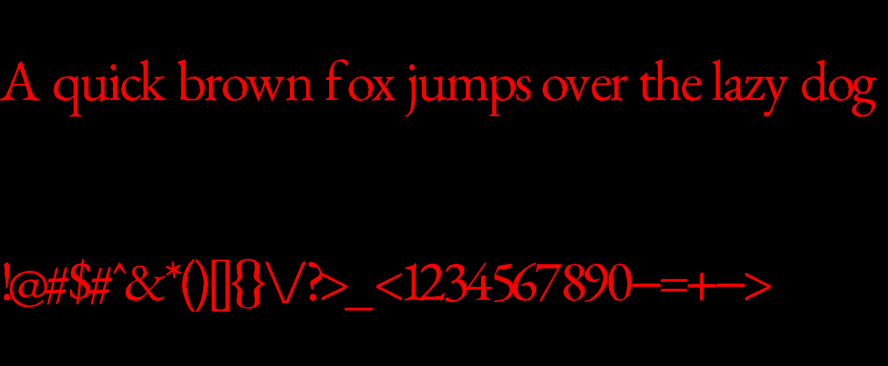

# phont

A very basic True-Type Font rendering. Currently, the code is capable of rendering the outline of a glyph and fill the outline (for the most part). Uses GPU to fill the fonts.

<p align="center">
  
</p>

## setup

From within the root directory:
```
pip install -r requirements.txt
python main.py
```

## todo??

- [ ] Incorporate the metrics properly
- [x] Antialiasing (_it's a very simple subpixel antialiasing_)
- [ ] Blinking cursor to show the position.
  - [ ] Allow moving cursor
- [ ] Open a file
- [ ] UI to allow users to select different fonts or open files
  - [ ] Allow more controls over the font size, color, etc.
- [ ] Read the font contents without a special library (`fonttools` in this case)

## fonts used for experimenting

I do not own any of the fonts used in this repository. All the fonts are used for experimentation purposes and no commercial use.

- [EB-Garamond](https://github.com/georgd/EB-Garamond)
