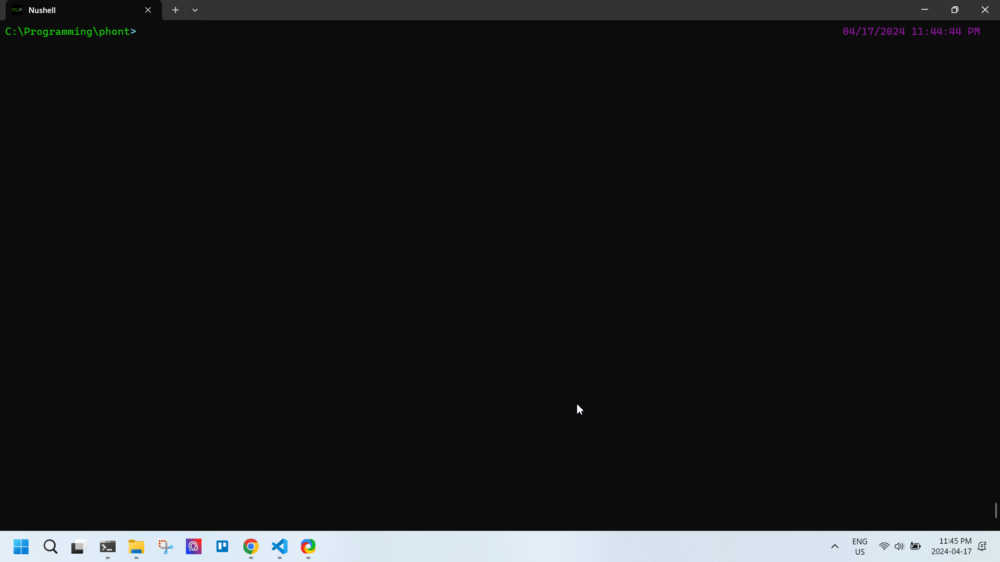

# phont

A very basic True-Type Font rendering. Currently, the code is capable of rendering the outline of a glyph.

<p align="center">
  
</p>

## setup

From within the root directory:
```
pip install -r requirements.txt
python main.py
```

Use the main letter buttons to render different characters.

## todo??

- [x] incorporate bezier curves as well
- [ ] allow users to press buttons other than capital letters
- [ ] read the font contents without a special library (`fonttools` in this case)
- [ ] fill the font outline

## fonts used for experimenting

I do not own any of the fonts used in this repository. All the fonts are used for experimentation purposes and no commercial use.

- [EB-Garamond](https://github.com/georgd/EB-Garamond)